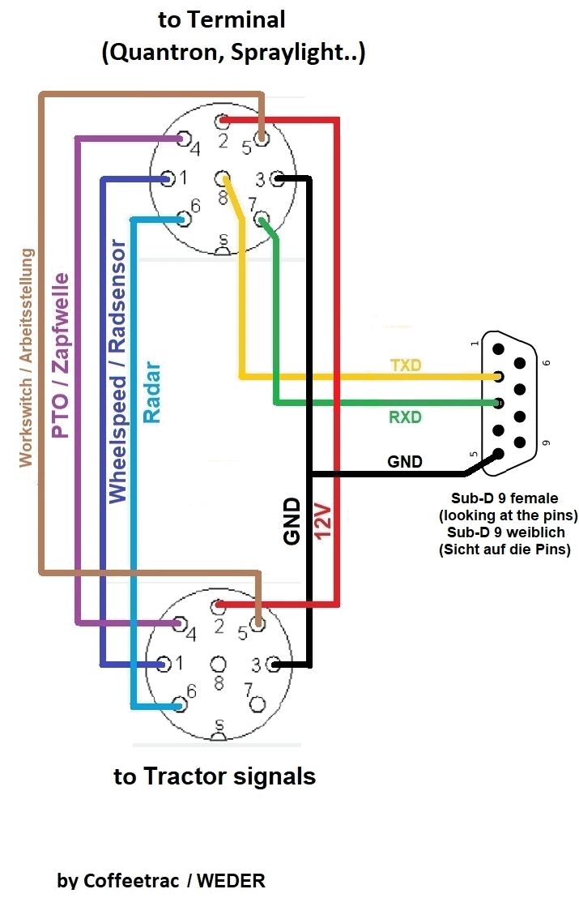

[](https://github.com/gunicsba/AOG_ASD_bridge/actions/workflows/build.yml)

# AOG-ASD Bridge

Bridge between **AgOpenGPS** and **ASD-compatible** sprayer/spreader terminals (Quantron, Amatron, etc.) via the ASD serial protocol.

AgOpenGPS sends section states via UDP. This bridge translates them into
ASD serial commands so the terminal opens and closes sections in real time.
Section feedback from the terminal is reported back to AgOpenGPS.

## Download

Grab the latest `AOG-ASD.exe` from [Releases](../../releases).

## Requirements

- Serial connection to the ASD terminal (USB-to-Serial adapter)
- AgOpenGPS / AgIO broadcasting on UDP port 8888

For development:
- Python 3.8+
- [pyserial](https://pypi.org/project/pyserial/) (`pip install pyserial`)

## Connection

Connect the PC to the ASD terminal's serial port using a USB-to-RS232
adapter. The ASD interface uses a standard serial connection (no null-modem
crossover needed -- the terminal has a DCE-style port).



Only TXD, RXD and GND are needed for the bridge (pins 1, 5, 9 on the Sub-D 9).

- **Baud:** 19200
- **Data bits:** 8, Parity: None, Stop bits: 1
- **Flow control:** None

## Usage

Run `AOG-ASD.exe`. On first run you will be prompted to select a COM port.
The choice is saved to `config.ini` so subsequent runs connect automatically.

Press **X** to exit.

## Features

| Feature | Description |
|---------|-------------|
| Section control | Sends section ON/OFF commands to ASD terminal |
| Section feedback | Reports actual terminal section state back to AgOpenGPS |
| GPS auto mode | Sets GPS-auto flag (byte 3 bit 7) on the ASD bus |
| Comms-lost safety | Sections zeroed when AgIO connection is lost |
| Auto-reconnect | 3-state machine handles connection loss and recovery |
| Configurable section count | Supports 4 or 8 section Quantron variants |

## How It Works

```
 AgOpenGPS / AgIO                    Bridge                  ASD Terminal
 +---------------------+      +------------------+      +-----------------+
 | Section control     |----->| UDP :8888        |      |                 |
 | Speed data          |      |                  |----->| SECT_SUBMIT     |
 | Hello heartbeat     |      |  Serial TX       |      | SECT_REQUEST    |
 |                     |      |  19200 8N1       |      | INIT_REQUEST    |
 | PGN 0xEA (sect data)|<----| UDP :9999        |      |                 |
 | PGN 0xED (from mach)|<----|                  |<-----| SECT_RESPONSE   |
 | Hello reply         |<----|  Serial RX       |<-----| INIT_RESPONSE   |
 +---------------------+      +------------------+      +-----------------+
```

## ASD Serial Protocol

- **Baud:** 19200, 8N1
- **Frame:** `STX <escaped payload> ETX`
- **STX** = `0x02`, **ETX** = `0x04`, **ESC** = `0x10`
- **Escaping:** Any payload byte equal to STX, ETX, or ESC is preceded by ESC on the wire
- **Payload:** `<obj> <type> <len> <data x len> <crc>` -- type `0x01` = write/data, `0x02` = read, `0x03` = init, `0x04` = reject (terminal)
- **CRC:** `-(sum of all payload bytes) & 0xFF`

### Commands (Bridge -> Terminal)

| Command | ID | Purpose | Rate |
|---------|----|---------|------|
| Init Request | `0x01` | Connection probe / handshake | 1 Hz (disconnected) |
| Init Config | `0x25`/`0x35` | Tool configuration | Once after init |
| Section Request | `0x55` | Poll current section state | Configurable Hz |
| Section Submit | `0x55` (sub `0x01`) | Set section states | On change |

### Responses (Terminal -> Bridge)

| Response | ID | Purpose |
|----------|----|---------|
| Init ACK | `0x00` (sub `0x03`) | Confirms terminal is alive |
| Section State | `0x55` (sub `0x01`) | Current section bitmask (4 bytes) |

### Section Byte Layout

The ASD protocol carries sections in 4 bytes (32 bits total):

| Byte | Sections |
|------|----------|
| `sect[0]` | Sections 1-8 (bit 0 = section 1) |
| `sect[1]` | Sections 9-16 |
| `sect[2]` | Reserved |
| `sect[3]` | Bit 7 = GPS Auto mode flag (`0x80`) |

### Amazone Amados (`machine = amados`)

The Amados has no section object (`0x55`/`0x25`/`0x35` are rejected). It
exposes float values instead (data = tool ID `05 00`, index byte, float LE):

| Object | Meaning | Access |
|--------|---------|--------|
| `0x00` | Target rate kg/ha. Read = average of both sides | Write index `1` = left side, `2` = right side (`0` = whole machine, never written by the bridge) |
| `0x10` | Distance counter (~1 m / count) | Read |
| `0x20` | Actual rate kg/ha, averaged over the width | Read only |
| `0x30` | Area counter (~10 m² / count) | Read |
| `0x40` | Active working width, m (e.g. 36 / 18 / 0) | Read |
| `0x50` | Speed, km/h | Read |

Sections are emulated with per-side rates. With `sections = 8`, sections
1-4 are the left side and 5-8 the right side; each closed section removes
25 % of the base rate from its side, so 1-4 closed = left side at 0.

The base rate is read from the terminal (`0x00`) before the first write. If
the terminal's target later stops matching the average of the side rates
the bridge sent, the operator changed it on the terminal and it becomes the
new base. Set `base_rate` to pin it instead. On exit both sides are
restored to the base rate.

The shutters are slow (a 250 -> 0 ramp needs ~10 s to be followed), so give
AgOpenGPS enough section look-ahead.

## State Machine

```
DISCONNECTED ──[Init ACK]──> READY ──[AgIO connected]──> RUNNING
     ^                          |                            |
     └───────── [10s timeout] ──┴────────────────────────────┘
```

| State | Activity |
|-------|----------|
| DISCONNECTED | Init Request probe at 1 Hz |
| READY | Machine connected, waiting for AgIO; section polling active |
| RUNNING | Sending section commands, speed; full AOG feedback |

## AgOpenGPS PGNs

### Incoming from AgIO (port 8888)

| PGN | Name | What the bridge does |
|-----|------|----------------------|
| `0xC8` | AgIO Hello | Replies with Hello Machine PGN (icon turns green) |
| `0xEF` | Machine Data | Bytes 11-12 = section mask, forwarded to terminal |
| `0xFE` | Steer Data | Speed + section bits extracted |

### Outgoing to AgIO (port 9999)

| PGN | Description |
|-----|-------------|
| `0x7B` (123) | Hello Reply (machine alive) |
| `0xEA` (234) | Section Control Data (relay ON/OFF bytes) |
| `0xED` (237) | From Machine (current relay state) |

## config.ini

Created automatically on first run.

```ini
[main]
com = COM3
comms_lost_zero = 1
sections = 8
sct_hz = 2
subnet = 255.255.255.255
machine = quantron
base_rate = 0
```

| Parameter | Default | Description |
|-----------|---------|-------------|
| `com` | `0` (prompt) | Serial port. Set to `0` to prompt on startup |
| `comms_lost_zero` | `1` | Zero all sections when AgIO connection is lost |
| `sections` | `8` | Number of sections (4 or 8 for Quantron) |
| `sct_hz` | `2` | Section request polling rate in Hz |
| `subnet` | `255.255.255.255` | UDP broadcast address |
| `machine` | `quantron` | `quantron` (section bitmask, `0x55`) or `amados` (per-side rates, see above) |
| `base_rate` | `0` | Amados only: base rate kg/ha, `0` = read from the terminal |

## Files

| File | Purpose |
|------|---------|
| [AOG_ASD_bridge.py](AOG_ASD_bridge.py) | Main bridge. Threads: UDP, serial RX, periodic TX, keyboard |
| [asd_protocol.py](asd_protocol.py) | ASD framing, escaping, CRC, packet builders, stream parser |
| [asd_sniffer.py](asd_sniffer.py) | `AOG-ASD-Sniffer.exe`: passive RS232 logger (never transmits) |
| [asd_probe.py](asd_probe.py) | `AOG-ASD-Probe.exe`: object scan, `--watch`, rate `--ramp` tests |
| [build.bat](build.bat) | PyInstaller one-file build -> `AOG-ASD.exe` |
| [startup.bat](startup.bat) | Convenience launcher |
| [config.ini](config.ini) | Auto-created on first run (see above) |

## Building

```bat
build.bat
```

Produces `AOG-ASD.exe` via PyInstaller.

## Credits

Based on the ASD host protocol by Coffeetrac (W.Eder, 2019) and
Daniel Desmartins (2025). Rewritten as a PC-based serial-UDP bridge
for direct AgOpenGPS integration without ESP32 hardware.

## License / legal

This bridge is a clean-room reimplementation for AgOpenGPS integration.
