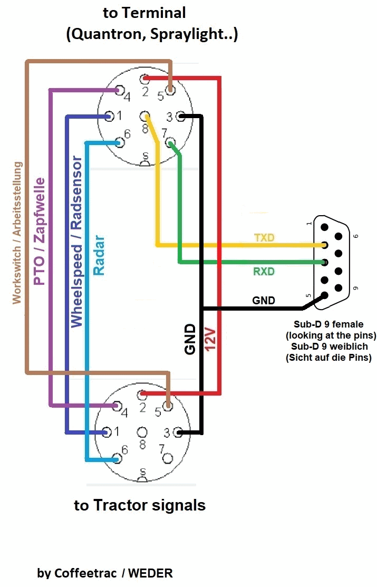

[](https://github.com/gunicsba/AOG_ASD_bridge/actions/workflows/build.yml)

# AOG-ASD Bridge

Bridge between **AgOpenGPS** and **ASD-compatible** sprayer/spreader terminals (Quantron, Amatron, Amados etc.) via the ASD serial protocol.

AgOpenGPS sends section states via UDP. This bridge translates them into
ASD serial commands so the terminal opens and closes sections in real time.
Section feedback from the terminal is reported back to AgOpenGPS.

## Download

Grab the latest `AOG-ASD.exe` from [Releases](../../releases).

## Requirements

- Serial connection to the ASD terminal (USB-to-Serial adapter)
- AgOpenGPS / AgIO broadcasting on UDP port 8888

For development:
- Python 3.8+
- [pyserial](https://pypi.org/project/pyserial/) (`pip install pyserial`)

## Connection

Connect the PC to the ASD terminal's serial port using a USB-to-RS232
adapter. The ASD interface uses a standard serial connection (no null-modem
crossover needed -- the terminal has a DCE-style port).



The terminal's ASD / signal connector is a **Binder Series 680, 8-pin**
circular connector (8 contacts + shield). The cable in the diagram is a
Y-adapter: it passes the tractor signals (wheel speed, radar, PTO, work
switch, 12 V, GND) straight through and taps the serial lines out to a
Sub-D 9 female that plugs into the USB-to-RS232 adapter.

### Pinout

| Binder 680 pin | Signal | Wire colour (diagram) | Sub-D 9 pin |
|:--:|--------|------|:--:|
| 1 | Wheel speed / Radsensor | blue | – |
| 2 | +12 V | red | – |
| 3 | GND | black | **5** |
| 4 | PTO / Zapfwelle | purple | – |
| 5 | Work switch / Arbeitsstellung | brown | – |
| 6 | Radar | light blue | – |
| 7 | RXD | green | **3** |
| 8 | TXD | yellow | **2** |
| S | Shield | – | – |

Only TXD, RXD and GND are needed for the bridge (Binder pins 8, 7, 3 →
Sub-D 9 pins 2, 3, 5). Signal names are as labelled in the diagram; if you
get no response from the terminal, try swapping TXD/RXD at the Sub-D end.

> Pin numbers are as printed on the connector inserts. Always check the
> numbering against the connector you actually have before soldering, and
> never connect the +12 V line to the serial adapter.

### Connector parts

Plugs that mate with the terminal-side socket (Binder Series 680, 8-pin
male cable connectors, solder contacts):

| Part number | Description | Link |
|-------------|-------------|------|
| Binder 09-0571-00-08 | Series 680 male cable connector, 8-pin | [Bürklin 66F114](https://www.buerklin.com/en/p/binder/other-circular-connectors/09-0571-00-08/66F114/) |
| Binder 09-0571-02-08 | Series 680 male cable connector, 8-pin (variant with different cable clamp range) | [Bürklin 66F134](https://www.buerklin.com/en/p/binder/other-circular-connectors/09-0571-02-08/66F134/) |

Pick the variant whose cable-clamp range matches the outer diameter of the
cable you are using (see the Binder datasheet on the product page). For
the Sub-D side, any standard 9-pin female solder connector with hood works.

**Ready-made cable:** Müller Elektronik sells an adapter cable for using the
ASD application with other manufacturers' terminals (e.g. Rauch, Quantron E,
E2): [Adapterkabel für ME-Terminals](https://roltronik.pl/de/suche-nach-hersteller-marke/565891-adapterkabel-f%C3%BCr-me-terminals.html),
art. no. 3032254800. Key-operated ME terminals need hardware version 3.0.0 or
later. Not tested with this bridge yet.

- **Baud:** 19200
- **Data bits:** 8, Parity: None, Stop bits: 1
- **Flow control:** None

## Usage

Run `AOG-ASD.exe`. It opens a window (made for touch screens) showing:

- the terminal and AgIO connection, and whether AgOpenGPS or the terminal
  is in control;
- the **base rate** (Amados) and where it came from, with −10 / −1 / +1 /
  +10 buttons (hold to repeat) and **Set rate** to send a new one;
- the sections AgOpenGPS commands, split into left / right side, with the
  rate sent to each side (→) and the rate the terminal reports (←);
- the log, plus **Settings**, **Logs folder** and **Export logs** (zips the
  recent logs and config.ini, e.g. onto a USB stick).

On first run pick the COM port at the bottom and press **Connect**; the
port is saved to `config.ini` and used automatically next time. Closing the
window hands the machine back to the terminal (both sides at the base rate).

`AOG-ASD.exe --console` (or `python AOG_ASD_bridge.py --console`) runs the
old text mode; press **X** to exit.

### Languages

Window texts are in `lang/<code>.ini` (English, Magyar, Français, Deutsch,
Polski included). Pick one in Settings; `auto` follows the Windows language.
To add or fix a language, copy `lang/en.ini` to a `lang` folder next to
`AOG-ASD.exe` under a new name (e.g. `lang/it.ini`), translate the values
and restart. Missing keys fall back to English.

### Logs

Each run writes a DEBUG log to `logs/`. At startup, logs of earlier runs are
zipped into `logs/archive/<date>.zip` and archives older than
`log_keep_days` (default 7) are deleted.

## Features

| Feature | Description |
|---------|-------------|
| Section control | Sends section ON/OFF commands to ASD terminal |
| Section feedback | Reports actual terminal section state back to AgOpenGPS |
| GPS auto mode | Sets GPS-auto flag (byte 3 bit 7) on the ASD bus |
| Comms-lost safety | AgIO / AgOpenGPS lost: all sections back on (Amados: both sides at the base rate), terminal in control |
| Auto-reconnect | 3-state machine handles connection loss and recovery |
| Configurable section count | Supports 4 or 8 section Quantron variants |

## How It Works

```
 AgOpenGPS / AgIO                    Bridge                  ASD Terminal
 +---------------------+      +------------------+      +-----------------+
 | Section control     |----->| UDP :8888        |      |                 |
 | Speed data          |      |                  |----->| SECT_SUBMIT     |
 | Hello heartbeat     |      |  Serial TX       |      | SECT_REQUEST    |
 |                     |      |  19200 8N1       |      | INIT_REQUEST    |
 | PGN 0xEA (sect data)|<----| UDP :9999        |      |                 |
 | PGN 0xED (from mach)|<----|                  |<-----| SECT_RESPONSE   |
 | Hello reply         |<----|  Serial RX       |<-----| INIT_RESPONSE   |
 +---------------------+      +------------------+      +-----------------+
```

## ASD Serial Protocol

- **Baud:** 19200, 8N1
- **Frame:** `STX <escaped payload> ETX`
- **STX** = `0x02`, **ETX** = `0x04`, **ESC** = `0x10`
- **Escaping:** Any payload byte equal to STX, ETX, or ESC is preceded by ESC on the wire
- **Payload:** `<obj> <type> <len> <data x len> <crc>` -- type `0x01` = write/data, `0x02` = read, `0x03` = init, `0x04` = reject (terminal)
- **CRC:** `-(sum of all payload bytes) & 0xFF`

### Commands (Bridge -> Terminal)

| Command | ID | Purpose | Rate |
|---------|----|---------|------|
| Init Request | `0x01` | Connection probe / handshake | 1 Hz (disconnected) |
| Init Config | `0x25`/`0x35` | Tool configuration | Once after init |
| Section Request | `0x55` | Poll current section state | Configurable Hz |
| Section Submit | `0x55` (sub `0x01`) | Set section states | On change |

### Responses (Terminal -> Bridge)

| Response | ID | Purpose |
|----------|----|---------|
| Init ACK | `0x00` (sub `0x03`) | Confirms terminal is alive |
| Section State | `0x55` (sub `0x01`) | Current section bitmask (4 bytes) |

### Section Byte Layout

The ASD protocol carries sections in 4 bytes (32 bits total):

| Byte | Sections |
|------|----------|
| `sect[0]` | Sections 1-8 (bit 0 = section 1) |
| `sect[1]` | Sections 9-16 |
| `sect[2]` | Reserved |
| `sect[3]` | Bit 7 = GPS Auto mode flag (`0x80`) |

### Startup object scan

ASD was designed for documentation (per Amazone support), and each terminal
implements a different set of objects. At every start the bridge reads all
objects `0x00`-`0xFF` once (reads only, about 10 s) and logs which ones
answer, with their raw bytes and float / integer interpretation. With
`machine = auto` the mode is chosen from that result. Set `startup_scan = 0`
to skip it when `machine` is set explicitly.

### Section bitmask mode (`machine = quantron`) -- EXPERIMENTAL

Based only on Coffeetrac's ESP32 code (object `0x55`). It has not worked on
any terminal we tested; it is selected only when the scan finds object `0x55`.

### Amazone Amados (`machine = amados`)

The Amados has no section object (`0x55`/`0x25`/`0x35` are rejected). It
exposes float values instead (data = tool ID `05 00`, index byte, float LE):

| Object | Meaning | Access |
|--------|---------|--------|
| `0x00` | Target rate kg/ha. Read = average of both sides | Write index `1` = left side, `2` = right side (`0` = whole machine, never written by the bridge) |
| `0x10` | Distance counter (~1 m / count) | Read |
| `0x20` | Actual rate kg/ha, averaged over the width | Read only |
| `0x30` | Area counter (~10 m² / count) | Read |
| `0x40` | Active working width, m (e.g. 36 / 18 / 0) | Read |
| `0x50` | Speed, km/h | Read |

Sections are emulated with per-side rates. With `sections = 8`, sections
1-4 are the left side and 5-8 the right side; each closed section removes
25 % of the base rate from its side, so 1-4 closed = left side at 0.

The base rate always comes from the terminal (`0x00`): it is read before
the first write, and if the terminal's target later stops matching the
average of the side rates the bridge sent, the operator changed it on the
terminal and it becomes the new base. It can also be set in the window.

The bridge only uses its own rate when the terminal reports 0:
- at startup, before the bridge wrote anything (the machine was left closed
  by a run that could not restore, e.g. power cut): the last known rate
  (`last_base_rate`) is used and the window shows a warning;
- while spreading (sections open) the terminal suddenly reads 0: the side
  rates are sent again.

A 0 the bridge caused itself (all sections closed) is ignored. Reads that
cross one of the bridge's own writes are skipped for 2 s.

The terminal only reports one target for the whole machine. The window shows
it under each side as "reported"; when it matches what was sent, each side
shows its own confirmed value.

Both sides are restored to the base rate (100 %) and control is handed
back to the terminal when:
- no section data arrives from AgOpenGPS for 3 s (AgOpenGPS or AgIO
  closed, network lost); the bridge takes over again when it returns;
- the bridge exits (window closed, Windows shutdown, or X / Ctrl+C /
  closing the console in `--console` mode).

In section-bitmask mode (Quantron), losing AgIO sends all sections on with
the GPS auto flag cleared.

The shutters are slow (a 250 -> 0 ramp needs ~10 s to be followed), so give
AgOpenGPS enough section look-ahead.

## State Machine

```
DISCONNECTED ──[Init ACK]──> READY ──[AgIO connected]──> RUNNING
     ^                          |                            |
     └───────── [10s timeout] ──┴────────────────────────────┘
```

| State | Activity |
|-------|----------|
| DISCONNECTED | Init Request probe at 1 Hz |
| READY | Machine connected, waiting for AgIO; section polling active |
| RUNNING | Sending section commands, speed; full AOG feedback |

## AgOpenGPS PGNs

### Incoming from AgIO (port 8888)

| PGN | Name | What the bridge does |
|-----|------|----------------------|
| `0xC8` | AgIO Hello | Replies with Hello Machine PGN (icon turns green) |
| `0xEF` | Machine Data | Bytes 11-12 = section mask, forwarded to terminal |
| `0xFE` | Steer Data | Speed + section bits extracted |

### Outgoing to AgIO (port 9999)

| PGN | Description |
|-----|-------------|
| `0x7B` (123) | Hello Reply (machine alive) |
| `0xEA` (234) | Section Control Data (relay ON/OFF bytes) |
| `0xED` (237) | From Machine (current relay state) |

## config.ini

Created automatically on first run.

```ini
[main]
com = COM3
sections = 8
sct_hz = 2
subnet = 255.255.255.255
machine = auto
startup_scan = 1
log_keep_days = 7
language = auto
```

| Parameter | Default | Description |
|-----------|---------|-------------|
| `com` | `0` | Serial port, set from the window. `0` = choose on startup |
| `sections` | `8` | Number of sections (4 or 8 for Quantron) |
| `sct_hz` | `2` | Section request polling rate in Hz |
| `subnet` | `255.255.255.255` | UDP broadcast address |
| `machine` | `auto` | `auto` (pick from the startup scan), `amados` (per-side rates) or `quantron` (section bitmask `0x55`, experimental) |
| `startup_scan` | `1` | Log a read-only scan of all ASD objects at every start (~10 s) |
| `last_base_rate` | (written by the bridge) | Amados only: last base rate, used only when the terminal reads 0 at startup. An old `base_rate` setting is moved here (it no longer overrides the terminal) |
| `log_keep_days` | `7` | Days to keep zipped logs, `0` = forever |
| `language` | `auto` | Window language: `auto` (Windows language) or a file name from `lang/` (`en`, `hu`, `fr`, `de`, `pl`) |

All of these except `com` and `last_base_rate` can be changed in Settings.

## Files

| File | Purpose |
|------|---------|
| [AOG_ASD_bridge.py](AOG_ASD_bridge.py) | Main bridge. Threads: UDP, serial RX, periodic TX (+ keyboard in `--console`) |
| [bridge_gui.py](bridge_gui.py) | The window (tkinter) |
| [i18n.py](i18n.py), [lang/](lang/) | Language loader and the language files |
| [log_archive.py](log_archive.py) | Log zipping, pruning and export |
| [asd_protocol.py](asd_protocol.py) | ASD framing, escaping, CRC, packet builders, stream parser |
| [asd_sniffer.py](asd_sniffer.py) | `AOG-ASD-Sniffer.exe`: passive RS232 logger (never transmits) |
| [asd_probe.py](asd_probe.py) | `AOG-ASD-Probe.exe`: object scan, `--watch`, rate `--ramp` tests |
| [build.bat](build.bat) | PyInstaller one-file build -> `AOG-ASD.exe` |
| [startup.bat](startup.bat) | Convenience launcher |
| [config.ini](config.ini) | Auto-created on first run (see above) |

## Building

```bat
build.bat
```

Produces `AOG-ASD.exe` via PyInstaller.

## Credits

Based on the ASD host protocol by Coffeetrac (W.Eder, 2019) and
Daniel Desmartins (2025). Rewritten as a PC-based serial-UDP bridge
for direct AgOpenGPS integration without ESP32 hardware.

## License / legal

This bridge is a clean-room reimplementation for AgOpenGPS integration.
